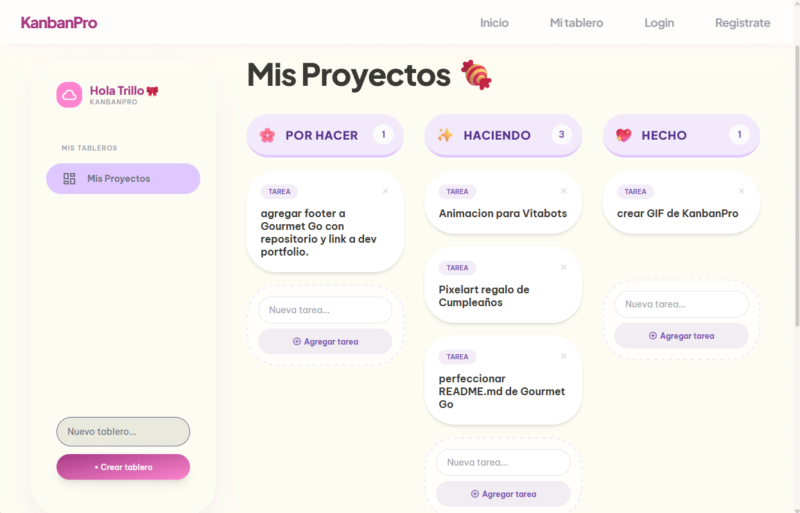
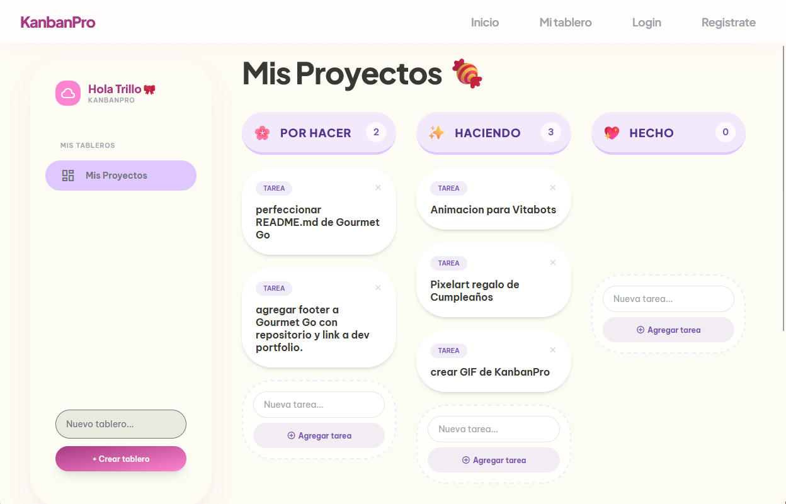

# KanbanPro

KanbanPro es una aplicación de gestión de tareas basada en el enfoque Kanban, diseñada para organizar flujos de trabajo mediante tableros, listas y tarjetas. Permite visualizar el progreso de proyectos de forma intuitiva mediante el movimiento de tarjetas entre diferentes estados.

---

## Vista previa

<!-- Reemplaza el siguiente enlace con tu propio GIF -->



---

## Características

- Creación y gestión de múltiples tableros
- Organización mediante listas (columnas)
- Creación, edición y eliminación de tarjetas
- Drag & drop para mover tarjetas entre listas
- Interfaz intuitiva y enfocada en productividad
- Persistencia de datos (según implementación)

---

## Tecnologías utilizadas

- [Aquí defines tu stack, por ejemplo:]
- Frontend: React / Vue / HTML / CSS / JavaScript
- Backend: Node.js / Express (si aplica)
- Base de datos: MongoDB / Firebase / LocalStorage (si aplica)

---

## Instalación

Clona el repositorio:

```bash
git clone https://github.com/tu-usuario/kanbanpro.git
cd kanbanpro